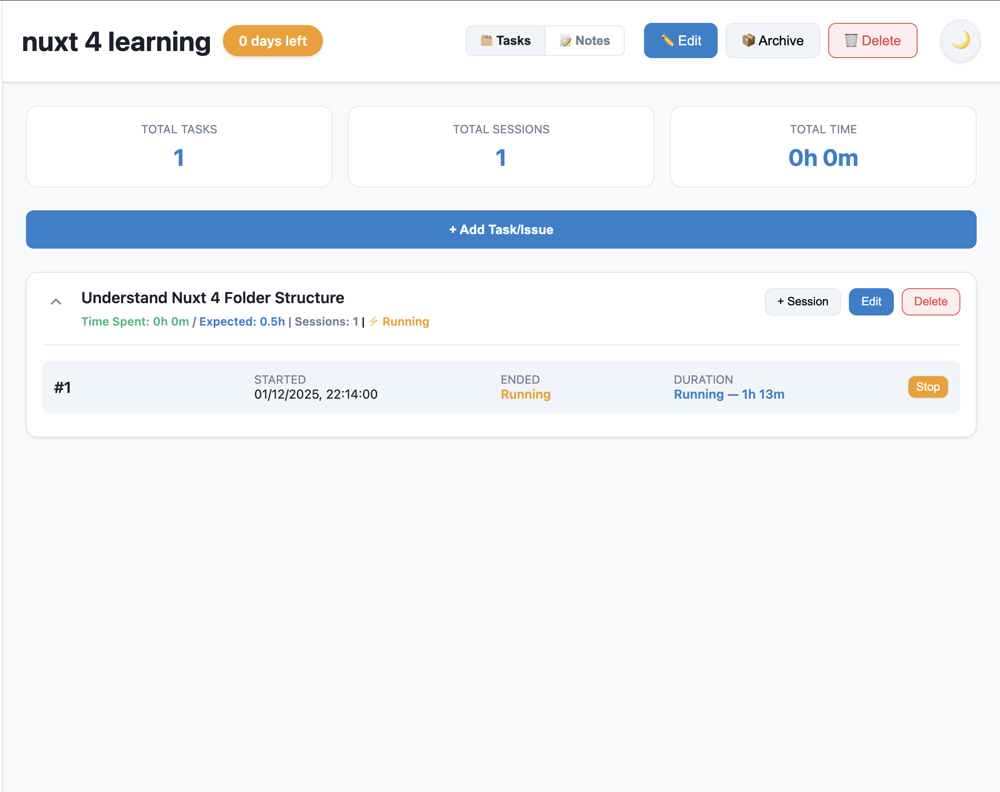

# Project Management - Local Version
Lightweight, browser-based Project Manager and Time Tracker (100% Offline)

This is a **local-only version** - a single-page web app with NO server required. All data is stored locally in your browser (localStorage). Perfect for personal use, offline scenarios, or when you want complete data privacy.

> **Note:** A Supabase-enabled version with cloud sync and multi-user support is available in a separate branch.

---

## Demo / Quick usage

1. **Simple**: Just open `login.html` in a modern browser (Chrome, Edge, Firefox, Safari)
2. **Login** with demo credentials:
   - Email: `demo@local.com` / Password: `demo123`
   - Email: `admin@local.com` / Password: `admin123`
3. **Or serve locally**:

```bash
# from the project root (macOS / Linux / Windows with Python installed)
python3 -m http.server 8000
# then open http://localhost:8000/login.html in your browser
```

---

## Main features

- **Projects**: create, edit, archive/unarchive or delete projects
- **Tasks**: add tasks to projects, set expected hours and expected end dates, mark as done/undone
- **Sessions (time tracking)**: add sessions either attached to a task or unassigned (project-level). Sessions can be started as "running" and later stopped — the app calculates durations automatically
- **Habit Tracker**: Track daily habits across three categories (Physical, Mental, Financial)
- **Spending Tracker**: Log and visualize daily expenses with category tagging
- **Notes**: per-project notes with a markdown-like editor — save with Ctrl+S (Windows/Linux) / Cmd+S (Mac)
- **Dark Mode**: GitHub-inspired dark theme; toggle between light and dark using the header button
- **100% Offline**: No internet connection required, all features work locally
- **Data Privacy**: Your data never leaves your device

---

## Key Features

### Floating session controls fix

- If a floating session window is open, the Close (✕) and Open buttons should now respond correctly even if you click within the header area. If you notice the controls not responding, ensure the page is focused and try again.

**Picture-in-Picture mode**: The floating session now uses the Document Picture-in-Picture API (Chrome 116+, Edge 116+) to open in a separate always-on-top window. This allows you to keep the session timer visible while working in other tabs or applications. The feature automatically falls back to an in-page floating div for browsers that don't support it.

Manual test: Start a session. Click the ℹ️ to open the floating session. In supported browsers, a separate PiP window will open. Then click ✕ to close it, and re-open it and click Open to navigate to the project view.
- Notes: per-project notes with a small editor — notes now save explicitly only when you click Save or press Ctrl+S (Windows/Linux) / Cmd+S (Mac). Previously there was live autosave.
- Dark Mode: a GitHub-inspired dark theme is included; toggle between light and dark using the header button — the preference is saved to localStorage.
- Persistence: all data (projects + theme preference) are stored in browser localStorage.

---

## UI details & behaviors

- The left sidebar shows your projects. Use the top tabs to switch between Active and Archived projects.
- Select a project to view project stats, tasks, unassigned sessions and notes.
- Use the task-level buttons to add sessions, edit tasks, or delete them. Deletion actions are permanent and will remove associated sessions.
- When you start a running session for a task or project, the UI updates durations automatically (refreshes every 30s for running items).
- Notes support a simple markdown-like renderer (headers, lists, code blocks, blockquotes, tables, inline code, bold/italic, and checkboxes). Click the Notes subtab to edit or create notes.
- Press Esc to close open modals. Clicking outside a modal will also close it.

---

## Files in this project

- `login.html` — Simple login page with localStorage-based authentication
- `index.html` — App HTML structure and markup for modals
- `styles.css` — Default (light) CSS using CSS custom properties
- `dark-theme.css` — GitHub-inspired dark theme stylesheet
- `app.js` — All UI logic (project/task/session/note/habit lifecycle, persistence, modal handling, markdown parsing)
- `SECURITY-FIXES.md` — Security features documentation for local version
- `.gitignore` — Typical ignores for the repository

---

## Storage & data format

**All data is stored in localStorage:**
- `currentUser` — Logged-in user information
- `projects` — JSON array of all projects with tasks and sessions
- `habits` — Habit tracker data
- `habitCompletions` — Daily habit completion records
- `habitSpendings` — Spending tracker data
- `theme` — Theme preference (`light` or `dark`)

**Important Notes:**
- Data is browser-specific and doesn't sync across browsers/devices
- Clearing browser storage will delete all data
- Export your data regularly for backup

Suggested actions if you want to start over:

1. Open dev tools → Application / Storage → Local Storage → delete all keys, OR
2. Click logout and clear browser data

### LocalStorage example (JSON)

Here is an example of how a saved `projects` array might look in localStorage. This is not the exact output for every case (fields are sometimes normalized in the app) but it gives a clear idea of structure and fields:

```json
[
	{
		"id": "1672500000000",
		"name": "Website Redesign",
		"description": "UI refresh + accessibility fixes",
		"expectedEndDate": "2025-12-31",
		"archived": false,
		"tasks": [
			{
				"id": "1672500000010",
				"title": "Landing page layout",
				"description": "Draft new responsive layout using flexbox/grid",
				"expectedHours": 8,
				"expectedEndDate": "2025-12-15",
				"sessions": [
					{
						"id": "1672500000020",
						"sessionNo": 1,
						"name": "Design session",
						"startedAt": "2025-12-01T09:30:00.000Z",
						"endedAt": "2025-12-01T11:00:00.000Z",
						"durationMinutes": 90
					}
				]
			}
		],
		"sessions": [
			{
				"id": "1672500000100",
				"sessionNo": 1,
				"name": "Project planning",
				"startedAt": "2025-11-30T14:00:00.000Z",
				"endedAt": "2025-11-30T15:00:00.000Z",
				"durationMinutes": 60
			}
		],
		"notes": [
			{
				"id": "1672500001000",
				"title": "Weekly goals",
				"content": "- Update hero image\n- Improve CTA contrast",
				"updatedAt": "2025-12-01T12:00:00.000Z"
			}
		],
		"createdAt": "2025-11-30T13:45:00.000Z"
	}
]
```

---

## Developer notes (no code changes requested)

- The app is a simple client-side single-file SPA (`index.html` + `app.js`). There's no build system.
- CSS variables in `styles.css` and `dark-theme.css` make it straightforward to tweak colors and spacing.
- Key behavior locations:
	- `app.js` — persistence (`localStorage.getItem('projects')`, `localStorage.setItem('projects', ...)`), the theme logic lives near the top and uses `localStorage.getItem('theme')`.
	- `dark-theme.css` — quickly tweak the GitHub-inspired palette.

---

## Known limitations

**This is the LOCAL-ONLY version:**
- ❌ No cloud backup or sync
- ❌ No multi-device support
- ❌ No real multi-user collaboration
- ❌ Browser localStorage has 5-10MB limit
- ❌ Data doesn't survive browser cache clearing
- ✅ 100% offline functionality
- ✅ Complete data privacy (data never leaves your device)
- ✅ No internet required
- ✅ Fast and lightweight

**Need cloud features?** Check out the Supabase-enabled version for:
- Cloud backup and sync
- Multi-device access
- Real authentication
- Unlimited storage

---

## Contributing

If you'd like to improve this project:

1. Clone the repository and work locally.
2. Follow standard Git workflows (feature branches, commit messages).
3. When making code changes, add short documentation or comments where relevant.

---

## Screenshots / Demo media

You can include screenshots or short GIFs in the README to demonstrate the UI, dark mode, or note editing. Follow this example layout and file locations:

- Place images under `assets/screenshots/` inside the repo. (This project currently doesn't include them; adding images won't change app behavior.)
- Recommended filenames:
	- `assets/screenshots/screenshot-1.png` — app overview (sidebar + project list)
	- `assets/screenshots/screenshot-2.png` — project view with tasks and sessions
	- `assets/screenshots/dark-mode.png` — the app in dark theme
	- `assets/screenshots/toggle-demo.gif` — short GIF showing theme toggle or a session being stopped

Example markdown to embed an image in this README:

```md

```

If you'd like, attach the images here (or add them to `assets/screenshots/`) and I'll add them to the README for you.
